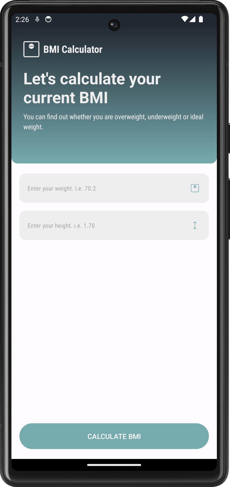
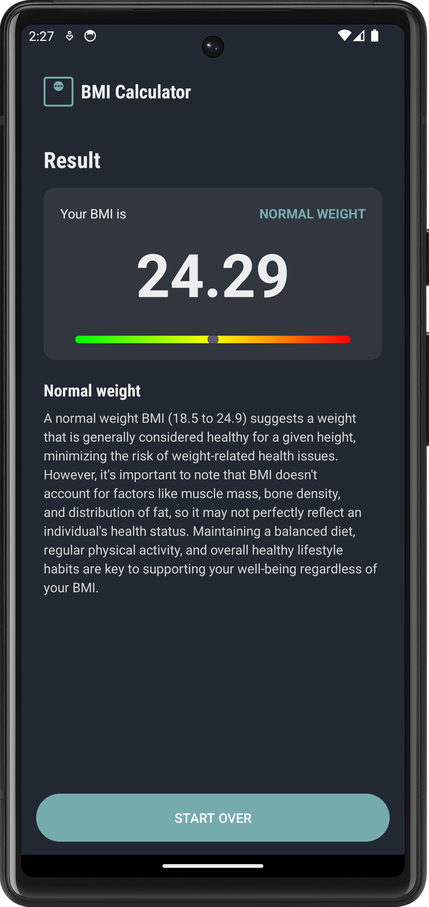

# BMI Calculator

## Project Description

This project is an Android native app developed in Kotlin, designed to calculate and display the Body Mass Index (BMI) of users based on their weight and height. The app features a user-friendly interface with a SeekBar that visually represents the user's BMI category. Users can input their weight and height, and the app calculates their BMI, categorizing it into one of the four standard categories: Underweight, Normal weight, Overweight, and Obesity.

## Key Features

1. BMI Calculation: Users can enter their weight and height, and the app will calculate their BMI using the standard formula: BMI = weight (kg) / height(m)²
2. Visual Representation: The app includes a custom SeekBar with a triangle-shaped thumb to indicate the user's BMI category. The SeekBar is color-coded:

   - Green for Underweight (BMI less than 18.5)
   - Yellow for Normal weight (BMI 18.5 to 24.9)
   - Orange for Overweight (BMI 25 to 29.9)
   - Red for Obesity (BMI 30 or higher)

3. Dynamic Descriptions: The app provides detailed descriptions for each BMI category, explaining the potential health implications and encouraging users to maintain or achieve a healthy weight. These descriptions are loaded from an external JSON file, allowing for easy updates and localization.
4. User-Friendly Interface: The app is designed with a clean and intuitive interface, making it easy for users to input their data and understand their BMI results.

## Teechnical Details:

- **Programming Language**: Kotlin
- **Development Environment**: Android Studio
- **Custom Drawables**: The app uses custom drawable resources for the SeekBar thumb and other UI elements.
- **External Resource Loading**: Descriptions for BMI categories are stored in a JSON file within the assets folder, demonstrating the app's ability to read and parse external files for dynamic content.


## :camera_flash: Screenshots
<!-- You can add more screenshots here if you like -->

<div class="flex">
   
   
</div>

## Tecnologies

- Activity
- intent
- Snackbar
- ViewGroups
  - Linear Layouts
  - Constrants Layouts
- Views
  - ImageView
  - TextView
  - EditText
  - Buttons
- SeekBar

````
## License
```
The MIT License (MIT)

Copyright (c) 2024 Emidio Valereto Neto

Permission is hereby granted, free of charge, to any person obtaining a copy of
this software and associated documentation files (the "Software"), to deal in
the Software without restriction, including without limitation the rights to
use, copy, modify, merge, publish, distribute, sublicense, and/or sell copies of
the Software, and to permit persons to whom the Software is furnished to do so,
subject to the following conditions:

The above copyright notice and this permission notice shall be included in all
copies or substantial portions of the Software.

THE SOFTWARE IS PROVIDED "AS IS", WITHOUT WARRANTY OF ANY KIND, EXPRESS OR
IMPLIED, INCLUDING BUT NOT LIMITED TO THE WARRANTIES OF MERCHANTABILITY, FITNESS
FOR A PARTICULAR PURPOSE AND NONINFRINGEMENT. IN NO EVENT SHALL THE AUTHORS OR
COPYRIGHT HOLDERS BE LIABLE FOR ANY CLAIM, DAMAGES OR OTHER LIABILITY, WHETHER
IN AN ACTION OF CONTRACT, TORT OR OTHERWISE, ARISING FROM, OUT OF OR IN
CONNECTION WITH THE SOFTWARE OR THE USE OR OTHER DEALINGS IN THE SOFTWARE.
```
